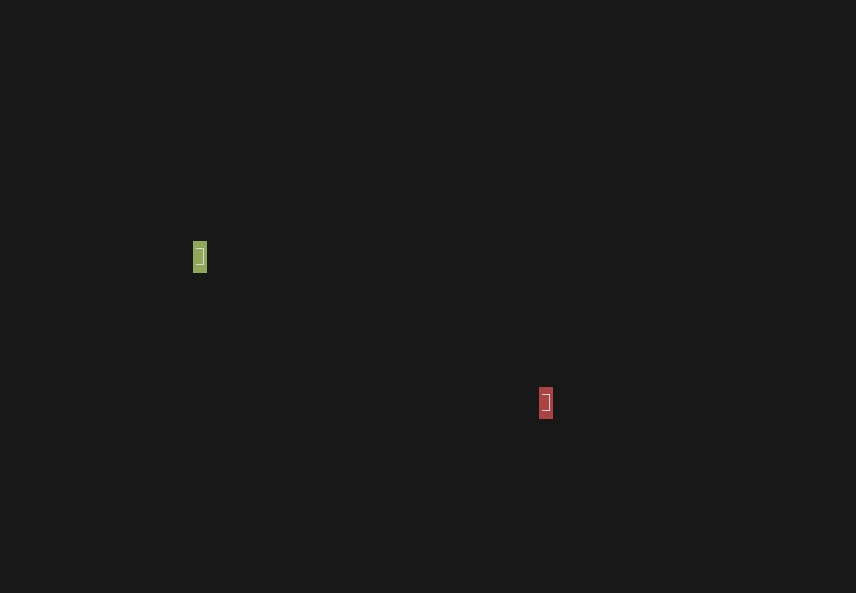

# kli

A TUI pseudo-game where 1 or 2 kids can control two cursors through the screen and discover some colors.



## Installation

### From Releases

Download the latest binary for your platform from the [releases page](https://github.com/andunieee/kli/releases).

### From Source

If you have Rust installed, you can install from crates.io:

```bash
cargo install kli
```

Or build from source:

```bash
git clone https://github.com/andunieee/kli.git
cd kli
cargo build --release
```
